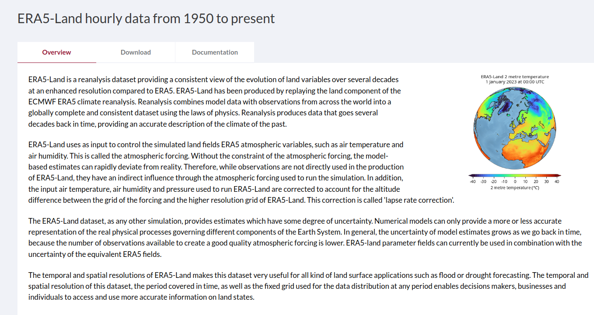

# ERA5-Land Data Downloader

This repository contains a Python-based tool designed to efficiently download ERA5-Land reanalysis data from the Climate Data Store (CDS) using the CDS API. The script, `Era_Downld_enhanced-V3.ipynb`, offers enhanced features such as concurrent downloading, robust error handling, and detailed logging, making it a reliable and efficient solution for managing large-scale climate data downloads.

## Features

- **Concurrent Downloading**: The script uses Python's `concurrent.futures` to handle multiple download tasks in parallel, significantly reducing the total download time.
- **Robust Error Handling**: Implements a retry mechanism with logging to handle download failures due to network issues or server errors.
- **Customizable**: Users can specify the time period (year, month, day, hour) for which data is required, as well as the geographic area and the variables of interest.
- **Detailed Logging**: Logs each download attempt, including successes and failures, allowing users to track the progress and troubleshoot issues.

## Prerequisites

Before running the script, ensure you have the following installed:

- **Python 3.x**
- **cdsapi library**: This library is required to interact with the CDS API.

  ```bash
  pip install cdsapi
  
## Setting Up the `.cdsapirc` File

To authenticate with the CDS API, you need to create a `.cdsapirc` file in your home directory. This file should contain your API credentials, which can be obtained from the CDS website.

### Steps to Create the `.cdsapirc` File:

1. **Register or Log In to Your CDS Account:**

   - Go to the CDS login page.
   - If you don't have an account, create one.

2. **Get Your API Key:**

   - After logging in, visit the API key page.
   - Copy the API key provided.

3. **Create the `.cdsapirc` File:**

   - In your home directory, create a file named `.cdsapirc` and paste the following:

     ```plaintext
     url: https://cds.climate.copernicus.eu/api/v2
     key: UID>:<API_KEY
     ```

### Usage Instructions

## Clone the Repository

First, clone the repository to your local machine:

```bash
git clone https://github.com/JuanCrls17/ERA5-Land-Data-Downloader.git
cd ERA5-Land-Data-Downloader

---

#### Important Notes

- **API Rate Limits**: The CDS API has usage limits. Excessive requests or continuous retries may result in temporary blocking of your IP. Always monitor your API usage.
- **Keep Your Environment Up to Date**: Regularly update your Python environment and the `cdsapi` library to avoid potential issues with API requests.


#### External Resources

For more detailed information about the ERA5-Land reanalysis data and the Climate Data Store, visit the following links:

- [CDS API Documentation](https://cds.climate.copernicus.eu/api-how-to)
- [ERA5-Land Overview](https://cds.climate.copernicus.eu/cdsapp#!/dataset/reanalysis-era5-land)


#### License

This project is licensed under the MIT License. See the LICENSE file for details.


#### Contributing

Contributions are welcome! If you have suggestions or improvements, feel free to submit a pull request or open an issue.


#### Acknowledgments

- **ECMWF**: For providing the ERA5-Land reanalysis dataset.
- **Copernicus Climate Change Service**: For their support and data services.


